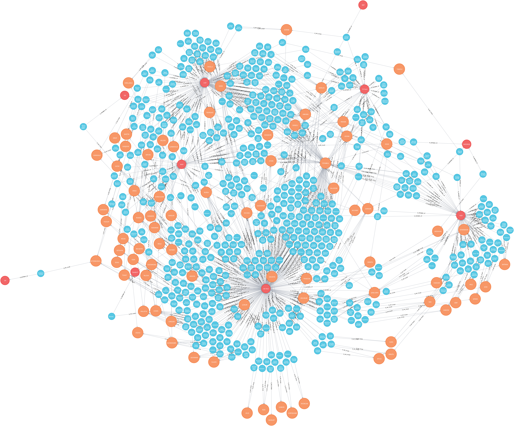

# my-first-neo4j-project

Reads provided json (named `tbmm.json`), which contains information crawled from [TBMM website](https://www.tbmm.gov.tr), and puts the information to neo4j database by creating nodes and relationships between those nodes.

You can see the resulting graph below.


## Usage

Run the following command in terminal.
```bash
$ python3 db_neo4j.py
```

## References 
See the [repo](https://github.com/afofa/tbmm-crawler) for crawling [TBMM website](https://www.tbmm.gov.tr).